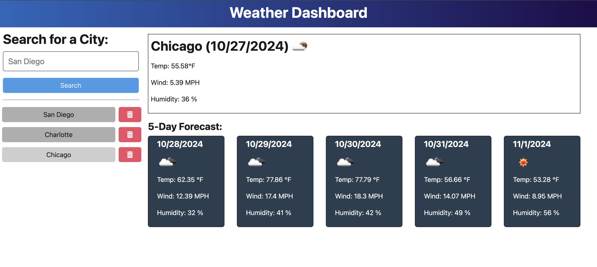

# Weather App 

## Description

This application was created to gather the week's weather and forecast data from the OpenWeather API for the city chosen by the user.  It was created in Javascript using Node.js, Typescript and with Express for routing. 

## Table of Contents
- [Installation](#installation)
- [Usage](#usage)
- [License](#license)
- [Contributing](#contributing)
- [Tests](#tests)
- [Questions](#questions)

## Installation

Install the packages with ``npm install``.  Run the application with ``npm run start`` at the root.
Ensure that you have a .env file that has your API key within it.  

.Env file contents: 
API_BASE_URL=https://api.openweathermap.org
API_KEY= {Your key goes here}

The base URL should look like the following:

https://api.openweathermap.org/data/2.5/forecast?lat={lat}&lon={lon}&appid={API key}

After registering for a new API key, you may need to wait up to 2 hours for that API key to activate.

For more information on how to work with the OpenWeather API, refer to the Full-Stack Blog on how to use API keys. 
https://openweathermap.org/api

## Usage

If you download the repo, begin by running ``npm run start`` in the command line.

From there you will be prompted to open http://localhost:3001.  

On the homepage, you can see a box to enter a City Name and hit search.  You will then be shown today's weather forecast inforamtion on top to the right.  Temperature, wind, humidity, and an overall weather descriptive icon will apepar.  

You will see your chosen city listed below as well in your search history.  
You can delete your city if you hit the trash can icon. Then your city will be removed from the history.

You will also see the next 5 days forecast for that city shown to the right below today's weather.

On the back end, the application should include a `searchHistory.json` file that will be used to store and retrieve cities using the `fs` module.

You can also experience this app at this URL for the hosted version:

## License

MIT License

The license for this application is MIT License.

https://opensource.org/license/MIT

## Contributing

Contributors: 

Caryn Carter https://github.com/Caryndcarter 

To contribute, contact carter.caryn@gmail.com.

## Tests

Tests for this application have not been written at this time.  When they are written, they will be added in this section.  

## Questions

For questions visit https://github.com/caryndcarter or write to carter.caryn@gmail.com.

